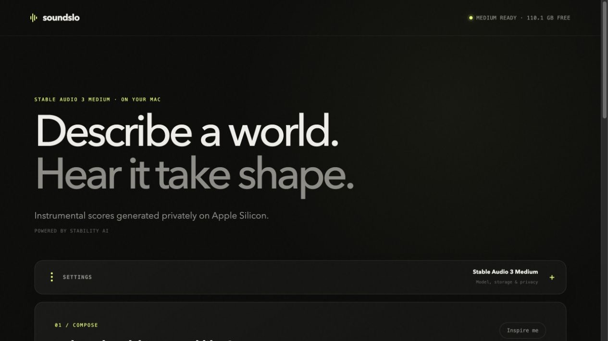

<div align="center">
  
  <h1>Soundslo</h1>
  <p><em>Generate private, six-minute instrumental soundtracks from text on your Apple Silicon Mac.</em></p>
  <p><strong>Powered by Stability AI.</strong></p>
</div>

<p align="center">
  
</p>

Soundslo is a private, local-first music workbench for **Stable Audio 3 Medium**. Describe an
instrumental in ordinary language, queue one or more renders, and manage the resulting WAV files
from a browser.

Soundslo is an independent project and is not affiliated with, sponsored by, or endorsed by
Stability AI.

The app uses Stability AI's native MLX runtime rather than PyTorch. It is pinned to a tested
runtime and model snapshot, stores its history in SQLite, and generates 44.1 kHz 16-bit stereo
WAVs.

## What it includes

- Text-to-music with arbitrary aesthetic, era, mood, instrumentation, and arrangement prompts
- 5–380 second renders (six minutes is 360 seconds)
- Stable Audio 3 Medium with the SAME-L decoder, FP16 DiT, and memory-conscious model unloading
- Negative prompting for vocals, configurable guidance, steps, duration, and reproducible seeds
- A durable, one-at-a-time generation queue with real stage and sampling-step progress
- Persistent history, in-browser playback, download, reveal in Finder, rename, retry, cancel,
  prompt reuse, runtime logs, and deletion of both the record and WAV
- A loopback-only web server; prompts and audio are not sent to a service

## Quick start

On an Apple Silicon Mac, clone or download this repository, open Terminal in its folder, and run:

```bash
bash scripts/setup.sh && bash scripts/run.sh
```

That is the entire setup. The script installs everything into this folder, downloads the model,
and opens Soundslo at [http://127.0.0.1:8733](http://127.0.0.1:8733). First setup needs internet
access, Git, and roughly 7 GB of free disk space. Generated WAVs use about 10 MB per minute.

After the first setup, start Soundslo with:

```bash
bash scripts/run.sh
```

Stop it with `Ctrl-C` in Terminal.

<details>
<summary>Setup details and troubleshooting</summary>

The setup script installs `uv` if needed, installs Soundslo, checks out the official Stability AI
runtime at revision `a0b57f5483c4588f827f3552b7d5c6ca2a9687be`, creates its isolated MLX
environment, and downloads model snapshot `6736003cb57d06b7b1fdc36fad31b2a3709e4774`.
It downloads only the files Medium needs for text-to-audio and deliberately skips the SAME-L
encoder used only for audio-to-audio and inpainting.

The weights come from `stabilityai/stable-audio-3-optimized` on Hugging Face. A cached Hugging
Face read token improves download reliability. If access is denied, sign in with `hf auth login`
and make sure your account can access the model repository, then rerun setup.

To use a different port:

```bash
SOUNDSLO_PORT=9000 ./scripts/run.sh
```

Always use the local URL or `bash scripts/run.sh`; `soundslo/static/index.html` is an application
template, not a standalone webpage. If it is accidentally opened directly, it redirects to the
default local URL automatically.

History and WAVs live in `data/` and are intentionally excluded from Git. The upstream runtime
and weights live in `.runtime/`, also excluded.

</details>

## Prompting tips

A useful prompt usually covers five things: genre or reference era, instrumentation, mood,
tempo or energy, and how the piece develops. For video backgrounds, also say whether it should
be sparse, unobtrusive, loop-like, climactic, or leave room for narration.

Example:

> 1960s speculative-science orchestral score, tense low strings and bass clarinet, distant brass
> swells, subtle analog electronic pulses, slow 72 BPM, mysterious and spacious, gradual build,
> instrumental, no melody competing with narration

The default guidance value of 3 enables the negative prompt and gives stronger text alignment,
but it is roughly twice as expensive as guidance 1. Eight sampling steps is the upstream model's
intended setting; more steps are not guaranteed to improve quality.

## Development

```bash
uv sync --dev
uv run pytest
uv run ruff check .
```

The app is FastAPI plus plain HTML, CSS, and JavaScript—there is no Node build step. Its local API
documentation is available at `/docs` while the server is running.

## Licensing

The original Soundslo source code in this repository is available under the [MIT License](LICENSE).
That license does **not** relicense Stable Audio 3, T5Gemma, downloaded model weights, or other
third-party components.

The setup process downloads third-party materials rather than committing or redistributing them:

- Stability AI's `stable-audio-3` runtime is downloaded from its official repository under its
  MIT software license.
- Stable Audio 3 model weights are downloaded separately under the
  [Stability AI Community License](licenses/STABILITY_AI_COMMUNITY_LICENSE.md). Commercial users
  must [register with Stability AI](https://stability.ai/community-license). If the user and its
  affiliates exceed USD $1 million in aggregate annual revenue, commercial model use requires a
  separate [Enterprise License](https://stability.ai/enterprise). Model use and outputs are also
  subject to Stability AI's [Acceptable Use Policy](https://stability.ai/use-policy).
- The downloaded text encoder contains T5Gemma weights governed by the
  [Gemma Terms of Use](licenses/GEMMA_TERMS_OF_USE.md) and its incorporated prohibited-use policy.

Required third-party attributions are retained in [NOTICE](NOTICE). As between users and
Stability AI, users own generated outputs to the extent permitted by law, but they remain
responsible for the outputs and their uses.

Python packages resolved by `uv` are installed as separate dependencies and retain their own
licenses; their code is not vendored into this repository. Anyone producing a future standalone
application bundle should repeat the dependency audit and include all notices required by the
versions actually bundled. Contributions are accepted under the terms in
[CONTRIBUTING.md](CONTRIBUTING.md).

Only Soundslo's source code is offered as OSI-style open-source software. The complete installed
application depends on model weights with use and revenue restrictions, so the full model stack
should be described as an **open-source application using separately licensed open-weight
models**, not as an entirely MIT-licensed or entirely open-source distribution.

## Current scope and natural next steps

This first version intentionally focuses on testing Medium's raw text-to-instrumental quality.
The downloaded decoder can render finished audio, but audio-to-audio variation and inpainting
also need the skipped SAME-L encoder. Logical follow-ons are timeline-aware multi-section prompt
planning, continuation/overlap assembly for longer scores, loudness normalization, stems or MIDI
companions, video-duration fitting, and LoRA style adapters trained on licensed material.
